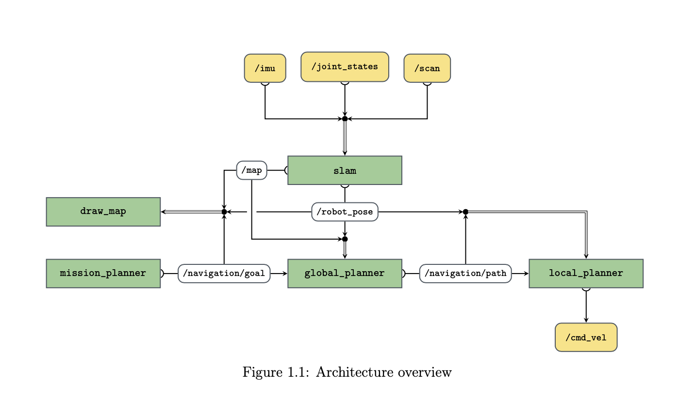

## Robotics Project
NUS, EE4308, AY19/20, Semester 2

Authors: Marc Rauch\*, Jan Hünermann\*

This is the code for the robotics project of EE4308 at NUS. The goal of the project was
having the robot navigate an unknown environment on its own. For that, we implemented

- an odometry motion model
- binary log-odds model for LiDAR based mapping
- Theta-Star global path planner
- Spline based local planner with pure pursuit
- PID controller

All of this was implemented from scratch with ROS and Gazebo, only dependencies being OpenCV and
Eigen3. The success of the project was proved in a final demonstration.

Furthermore, in the second part of the project we implemented an extended Kalman filter for controlling a drone that is
able to fly between the target and robot position.

\*: Equal contribution

### Install
Make sure you have the following requirements met:
- ROS Melodic
- Eigen 3 for math routines
- OpenCV 3 or higher
- Gazebo 9 with TurtleBot
- [hector_quadrotor](https://github.com/tu-darmstadt-ros-pkg/hector_quadrotor)

To install, clone this repository inside a folder called `catkin_ws/src`. Make sure you have all your other workspaces sourced, including the workspace containing the hector_quadrotor packages. Then build the workspace by running the following command from the directory `catkin_ws`.
```bash
catkin_make install -DCMAKE_BUILD_TYPE=Release
```

### Launch
To launch the robot, run the following command:
```bash
roslaunch bringup robot_bringup.launch
```
or
```bash
roslaunch bringup proj1.sh
```
to start the mission.

### TODO
#### Part 1
- [x] Mapping and motion model
- [x] Global planning
- [x] Trajectory generation and following

#### Part 2
- [x] Sensor fusion
- [x] Extend mission planner
- [x] Motion control (easy)
- [x] Modify launch structure
- [x] Fine-tune ground robot

### Topics
- `/robot_pose`: geometry\_msgs/Pose2D
- `/map`: nav\_msgs/OccupancyGrid
- `/navigation/goal`: geometry\_msgs/Pose2D
- `/navigation/path`: nav\_msgs/Path, global coordinates
- etc


